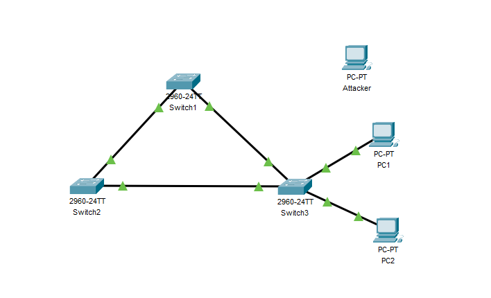
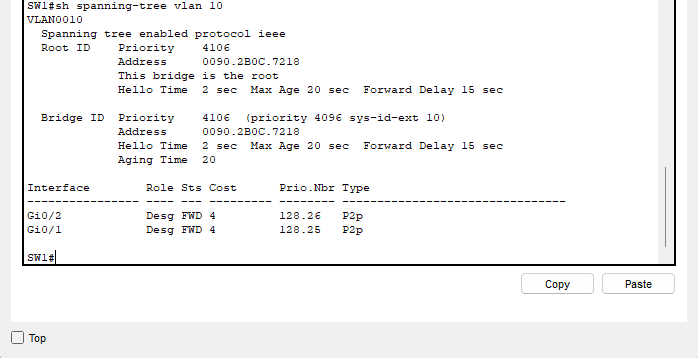
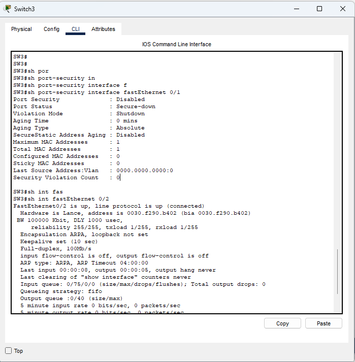
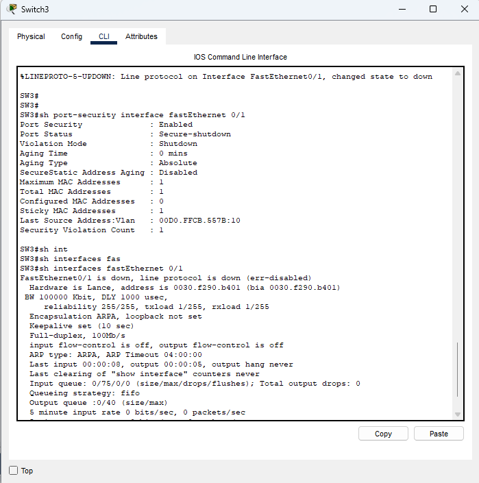

# Layer 2 Switching Lab: STP, VLANs, and Port Security

## Project Overview
This project demonstrates the deployment, optimization, and hardening of a Layer 2 enterprise switching architecture within a simulated environment (Cisco Packet Tracer). The lab establishes a resilient, loop-free multi-switch topology using Per-VLAN Spanning Tree Plus (PVST+), partitions broadcast domains via 802.1Q tagged trunk lines, and implements strict port-security policies at the access layer to mitigate unauthorized physical network intrusions.

## Core Technical Objectives
* **VLAN Segmentation & 802.1Q Trunking:** Isolate logical departments (VLAN 10/Sales and VLAN 20/Marketing) and configure inter-switch trunks to safely multiplex traffic across a physical loop topology.
* **STP Deterministic Path Manipulation:** Overrule default MAC-based elections to force a predictable Root Bridge placement for redundant link paths and identify blocked boundary loops.
* **Access Layer Hardening (Port Security):** Implement dynamic MAC binding (`sticky`), enforce strict connection limits, and configure proactive violation traps (`shutdown`) to defend against rogue network access.

---

## Topology Architecture & Subnet Plan

The architecture utilizes a standard three-switch triangle configuration to guarantee redundant paths, wired with Gigabit links for backbones and FastEthernet links for access nodes.

* **SW1 (Core / Root Bridge):** Priority 4096 for VLAN 10 and 20.
* **SW2 (Distribution Switch):** Redundant distribution pathway.
* **SW3 (Access Switch):** Enforces Layer 2 security boundaries for end hosts.

### Network Diagram


### Addressing Matrix
| Device | Interface | VLAN | IP Address | Subnet Mask | Purpose |
| :--- | :--- | :--- | :--- | :--- | :--- |
| **PC-A** | SW3 Fa0/1 | VLAN 10 | 192.168.10.10 | 255.255.255.0 | Authorized Sales Host |
| **PC-B** | SW3 Fa0/20 | VLAN 20 | 192.168.20.20 | 255.255.255.0 | Authorized Marketing Host |
| **Attacker-PC** | SW3 Fa0/1 | VLAN 10 | 192.168.10.99 | 255.255.255.0 | Rogue Intruder Device |

---

## Configuration & Verification Milestones

### 1. Spanning Tree Path Optimization
To prevent default MAC-based convergence loops, SW1 was configured with a lower bridge priority ($4096$). Because Cisco PVST+ appends the System ID Extension, the final calculated priority appears as $4106$ for VLAN 10 ($4096 + 10$).

Verification via `show spanning-tree vlan 10` confirms SW1 is recognized globally as the master root bridge, placing all local interfaces into a Designated Forwarding state.



### 2. MAC Address Binding & Port Security
Port-security parameters were applied directly to interface `Fa0/1` on SW3. The switch was instructed to allow a maximum of 1 device per port, learn the MAC address dynamically via standard frame headers, and permanently save it into the running configuration.

The baseline verification showing `Secure-up` and a recorded `Sticky MAC Address` count of `1` indicates the environment successfully cached the authorized host and is fully armed:



### 3. Attack Simulation & Incident Mitigation
To test containment capabilities, the authorized host (PC-A) was physically disconnected from interface `Fa0/1` and replaced with an unauthorized laptop configured with a functional IP stack. 

The moment the rogue device transmitted an initial ICMP packet onto the network, the incoming frame header failed the switch's hardware verification match. The port security engine immediately tripped, dropping the link into an administrative safety lock down.

* **Interface Line State:** Changed to `down (err-disabled)`
* **Security Violation Count:** Incremented to `1`



---

## Administrative Recovery Protocol
To safely re-verify and restore connectivity to an interface pushed into an `err-disabled` safety lock by port security:
1. Disconnect the malicious or unapproved device from the network port.
2. Re-attach the validated, authorized hardware asset.
3. Access the switch CLI and manually clear the error state flag by bouncing the port:
   ```text
   SW3# configure terminal
   SW3(config)# interface f0/1
   SW3(config-if)# shutdown
   SW3(config-if)# no shutdown
